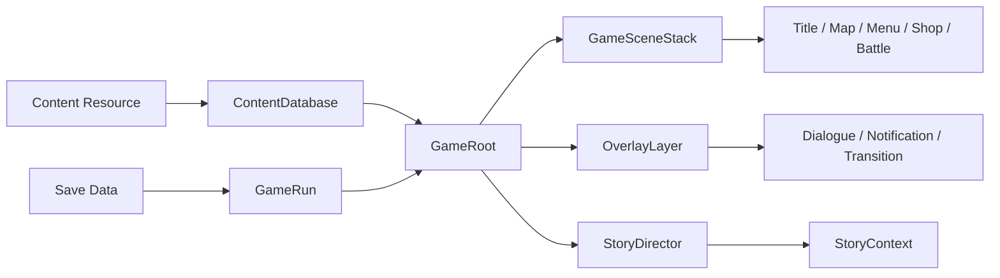

# 运行时架构

## 1. 总览

Godot PAL 使用“静态内容、当前进度、活动场景”三个独立模型：

本章描述框架的长期边界；当前正式内容以原创斜坡小铺验证 MapGameScene、移动、互动、
碰撞、YSort、菜单和存档。商店、战斗等通用能力暂时保留，但不登记到首个正式切片。



- ContentDatabase 回答“游戏里定义了什么”。
- GameRun 回答“这次游戏当前发生了什么”。
- GameSceneStack 回答“玩家现在位于哪个主要界面”。
- StoryContext 为剧情脚本提供稳定的高层能力。

流程不再由 GameFlow 枚举重复保存；当前 SceneStack 和 Overlay 状态就是流程事实。

## 2. 生命周期

| 生命周期 | 主要对象 | 是否保存 |
|---|---|---|
| 应用 | GameRoot、GameSceneStack、Overlay、服务 | 否 |
| 一次游戏 | GameRun、PartyState、InventoryState、StoryState、GameFlags、WorldState | 是 |
| 当前地图 | MapGameScene、PlayerCharacter、NPC、CameraRig | 部分同步到 GameRun |
| 一段剧情调用 | StoryEvent Resource、StoryContext、StoryDirector 活动状态 | 首期不保存中途状态 |
| 一场战斗 | BattleGameScene、BattleSession、BattleActorState/View | 结束时同步结果 |
| 弹窗 | DialogueLayer、确认框、通知 | 否 |

架构边界首先由生命周期决定。短生命周期 Node 不能持有唯一的长期进度；长期 GameRun 不保存 SceneTree 引用。

## 3. GameRoot

当前持久主场景：

```text
GameRoot
├── GameSceneStack
├── StoryDirector
├── AssetLibrary
├── AudioService
├── SaveService
├── SettingsService
└── OverlayLayer (CanvasLayer)
    ├── DialogueLayer
    └── StatusLabel

GameRoot properties
├── content_database: ContentDatabase Resource
├── story_module: StoryModule Resource
├── title_scene: PackedScene
└── game_run: GameRun RefCounted
```

Notification、Confirmation、Transition 和 Debug 等 Overlay 组件在真实内容需要时再加入，不为保持示意树而创建空节点。

`GameRoot` 是组合根：

- 创建新 GameRun 或安装已加载的 GameRun。
- 把 ContentDatabase、GameRun、GameSceneStack、Overlay 和当前地图上下文提供给 StoryDirector。
- 处理应用启动和退出。
- 不实现物品、战斗、剧情或地图规则。

GameRoot 本身作为项目主场景持久存在，初期不需要把这些对象做成 Autoload。

首期直接配置 Godot 根 Viewport 为 `320 x 180`，默认窗口为严格 3 倍的 `960 x 540`，使用 `viewport` stretch、`keep` aspect 和最近邻纹理。窗口允许缩放并以 F11 切换全屏；没有世界/UI 双分辨率需求前不增加自定义 SubViewport。

## 4. GameSceneStack

### 4.1 GameScene

标题、地图、菜单、商店和战斗都继承一个很薄的 GameScene 基类：

```gdscript
class_name GameScene
extends Node

func enter(context: GameSceneContext, arguments: Variant) -> void:
    pass

func pause_scene() -> void:
    process_mode = Node.PROCESS_MODE_DISABLED

func resume_scene(_result: Variant) -> void:
    process_mode = Node.PROCESS_MODE_INHERIT

func exit_scene() -> void:
    pass
```

基类只定义生命周期，不承载 UI 框架或游戏规则。

### 4.2 栈操作

| 操作 | 行为 | 示例 |
|---|---|---|
| `push` | 暂停当前 GameScene，进入新场景 | 地图 -> 菜单/商店/战斗 |
| `pop` | 销毁顶层场景，携带结果恢复上一层 | 战斗 -> 地图 |
| `replace` | 销毁并替换顶层场景 | 地图 A -> 地图 B |
| `reset` | 清空整个栈并进入目标场景 | 游戏 -> 标题、新游戏 |

GameSceneStack 负责：

- 实例化 PackedScene。
- 注入 GameSceneContext 和参数。
- 串行化过渡，避免同一帧重复 push/pop。
- 设置可见性和 process_mode。
- 在 pop 时把结果返回给等待调用方。
- 在场景销毁前断开由栈建立的连接。

`reset/replace/pop` 返回过渡是否被接受；`push` 是可等待调用，返回对应顶层场景传给 `pop(result)` 的结果。reset 或 replace 移除一个仍被等待的 pushed scene 时，以 `null` 取消该等待者。过渡期间的重入通过 `transition_rejected` 诊断，不部分修改栈。

GameScene 不直接使用 `get_tree().change_scene_to_file()`，也不通过绝对路径找到其他 GameScene。

### 4.3 场景分类

- `TitleGameScene`：新游戏、继续和设置入口。
- `MapGameScene`：TileMap、玩家、NPC、Camera、地图剧情和传送点。
- `MenuGameScene`：状态、物品、装备、法术和系统菜单。
- `ShopGameScene`：买入/卖出事务，pop ShopResult。
- `BattleGameScene`：战斗规则和表现，pop BattleResult。
- `SaveLoadGameScene`：存档槽和加载确认。

Dialogue、提示和确认框是 Overlay 模态 UI，不成为 GameScene。地图剧情由 StoryBinding 触发 StoryModule/Event，不成为 CutsceneGameScene。

## 5. GameRun

`GameRun` 是一次游戏进度的根对象，使用 RefCounted 和明确子状态：

```text
GameRun
├── PartyState
│   └── ActorState[]
├── InventoryState
├── StoryState
├── GameFlags
├── WorldState
├── LocationState
└── EconomyState
```

示意：

```gdscript
class_name GameRun
extends RefCounted

signal party_changed
signal inventory_changed
signal flag_changed(flag_id: StringName)

var party: PartyState
var inventory: InventoryState
var story: StoryState
var flags: GameFlags
var world: WorldState
var location: LocationState
var economy: EconomyState
```

### 5.1 状态约束

- ActorState 保存 actor definition ID、等级、经验、HP/MP、装备 ID 和已学技能 ID。
- InventoryState 保存有序 item ID 与数量。
- StoryState 以 story ID 保存当前阶段，例如 `not_started/accepted/completed`。
- GameFlags 保存命名空间 StringName 到简单值。
- WorldState 以 map ID + persistent entity ID 保存宝箱、门、NPC 等长期状态。
- LocationState 保存 map ID、spawn ID，以及允许随地保存时的位置和朝向。
- EconomyState 保存金钱及未来其他货币。

GameRun 不保存：

- Node/NodePath。
- Texture、AudioStream 或 PackedScene。
- Content Resource 的运行时可变副本。
- 当前 Menu、Dialogue 或 Battle View。
- Camera 状态以外的场景表现细节。

### 5.2 状态修改

领域对象提供原子方法，例如：

```text
inventory.add_item(item_id, quantity)
inventory.remove_item(item_id, quantity)
party.equip(actor_id, slot, item_id)
economy.try_spend(amount)
flags.set_value(flag_id, value)
story.set_stage(story_id, stage_id)
```

失败操作必须保持原状态并返回类型化结果。UI 和 StoryContext 调用这些方法，不直接改内部数组或 Dictionary。

## 6. 静态定义与运行状态

每个 RPG 对象区分 Definition、State 和 View：

| 对象 | Definition | State | View |
|---|---|---|---|
| 主角/队员 | ActorDefinition | ActorState | PlayerCharacter、BattleActorView、ActorPanel |
| 物品 | ItemDefinition | InventoryEntry/装备 ID | ItemRow、图标 |
| 法术 | SkillDefinition | 已学习 ID、冷却等 | SkillRow、动画 Scene |
| 怪物 | EnemyDefinition | BattleActorState | BattleActorView |
| NPC | NpcDefinition | WorldEntityState | NpcCharacter |
| 状态 | StatusDefinition | StatusInstance | 图标、效果表现 |

Definition 是只读模板。运行时状态只保存语义 ID 和变化值，ContentDatabase 负责解析 Definition。

## 7. ContentDatabase

需要全局按 ID 查询或进入存档的 RPG Definition 以一条记录一个 `.tres` 保存。首期使用一个简单、显式的 ContentDatabase Resource 建立索引：

```text
ContentDatabase
├── actors_by_id
├── items_by_id
├── skills_by_id
├── enemies_by_id
├── statuses_by_id
├── npcs_by_id
├── shops_by_id
├── encounters_by_id
├── dialogues_by_id
└── maps_by_id
```

ContentDatabase 在启动时把类型化数组建立为 ID Dictionary。ContentCatalog 在编辑器或 CLI 请求时，从这些数组以及 `stories/` 扫描结果确定性派生 11 类内存目录；它不生成或维护第二个索引 Resource。

StoryModule 和只被故事直接引用的私有 DialogueDefinition 不要求登记到这个手写索引。validator 扫描 `stories/` 和地图 StoryBinding 检查它们；运行时从 binding 的类型化 Resource 引用进入模块。这样新增故事不会额外修改全局数据库文件。

ContentDatabase 提供类型化查询：

```gdscript
func actor(id: StringName) -> ActorDefinition
func item(id: StringName) -> ItemDefinition
func skill(id: StringName) -> SkillDefinition
func status(id: StringName) -> StatusDefinition
func enemy(id: StringName) -> EnemyDefinition
func encounter(id: StringName) -> BattleEncounter
```

缺失 ID 在开发构建中提供明确错误；加载存档时作为验证失败处理，不能静默返回空模板。

## 8. 玩家对象

玩家不是单一全局对象，而是一组围绕同一 Actor ID 的不同表示：

```text
ActorDefinition + ActorState
        |
        +-> PlayerCharacter      当前地图化身
        +-> BattleActorState     当前战斗规则状态
        +-> BattleActorView      当前战斗表现
        +-> ActorPanel           当前 UI 表现
```

### 8.1 PlayerCharacter

```text
PlayerCharacter (CharacterBody2D)
├── CharacterVisual
├── AnimationPlayer/AnimationTree
├── CollisionShape2D
├── InteractionDetector (Area2D)
└── PlayerController
```

PlayerCharacter 负责地图位置、碰撞、朝向、步行动画和交互目标，不拥有背包、金钱、等级或任务状态。

MapGameScene 进入时：

1. 从 GameRun PartyState 取得队长 ActorState。
2. 从 ContentDatabase 取得 ActorDefinition。
3. 实例化其 field character PackedScene。
4. 绑定 ActorState/Definition。
5. 放到 MapDefinition 的 spawn marker。
6. 让 CameraRig 跟随。

地图退出或保存时，MapGameScene 把位置、朝向和必要世界状态同步到 GameRun；PlayerCharacter 随地图销毁。

### 8.2 PlayerController 与剧情移动

PlayerController 只把 InputMap 转换成 FieldCharacter 的移动/交互意图，可以明确启停。

- 自由探索：PlayerController 驱动。
- StoryModule trigger：StoryDirector 禁用 PlayerController，并通过 `story.move_actor()` 驱动同一个 FieldCharacter。
- Menu/Battle push：MapGameScene 被 SceneStack 暂停，不处理输入。

CameraRig 独立于 PlayerCharacter，默认跟随玩家，剧情时可平移或切换目标。

### 8.3 战斗表示

BattleGameScene 不移动或 reparent PlayerCharacter。它根据 PartyState 创建 BattleActorState 和 BattleActorView；战斗结束后把需要保留的 HP/MP、经验、状态和库存变化同步回 GameRun。

## 9. MapGameScene 与 NPC

推荐地图结构：

```text
MapGameScene
├── GroundLayer (TileMapLayer)
├── DetailLayer (TileMapLayer)
├── CollisionLayer (TileMapLayer/StaticBody2D)
├── YSortRoot
│   ├── PlayerCharacter
│   ├── NPCs
│   └── DynamicProps
├── ForegroundLayer
├── CameraRig
├── SpawnPoints
├── Portals
├── Interactions
└── EntryStoryBindings[]
```

当前地图只使用一层场景继承：`map_game_scene_base.tscn` 保存 PlayerCharacter、Ground/Detail 图层、YSortRoot、SpawnPoints 和 HUD 等公共骨架；`inn_hall.tscn`、`rain_courtyard.tscn` 等具体地图保存自己的 TileMap cell、TileSet、碰撞、NPC、交互物和 spawn。地图 ID 与显示名只来自进入场景时注入的 MapDefinition。

具体地图的 TileSet 直接引用 `assets/original/` 中的原创 atlas，TileMap cell 数据序列化在
具体 `.tscn`。共享 `map_game_scene.gd` 只处理进入/离开、玩家放置、交互绑定和状态恢复，
不包含按地图 ID 选择 frame 或生成坐标的分支。增加地图不应修改共享脚本。

NpcDefinition 保存身份、名称、头像、场景 Sprite 和默认表现；地图 NPC 实例保存 `persistent_id`、初始位置、移动组件和 StoryBinding。

同一个 NpcDefinition 可以出现在不同地图或不同章节，但每个需要持久化的实例拥有唯一 map-local persistent ID。

MapGameScene 可以配置一个有确定顺序的 `Array[StoryBinding] entry_bindings`。StoryDirector 在出生点、玩家、NPC、Camera 和持久世界状态全部恢复后依次执行其中当前可以运行的 binding；全部完成前，新 PlayerController 保持禁用。同一时刻仍只有一个活动 StoryEvent，不并行运行多个入口剧情。

entry bindings 用于到达对白、镜头演出和必须在地图恢复后执行的剧情协调，不代替 PersistentEntity 的常规状态恢复。任一 entry binding 调用 terminal `travel_to()` 时，StoryDirector 停止当前地图剩余的入口调用，完成清理后切换地图。

## 10. StoryEvent、StoryModule 与 StoryBinding

### 10.1 StoryEvent

StoryEvent 是无运行时状态的 Resource，也是所有简单交互和复杂剧情的统一调用接口：

```gdscript
class_name StoryEvent
extends Resource

func get_trigger_ids() -> Array[StringName]:
    return [&"default"]

func can_run(_trigger_id: StringName, _story: StoryContext) -> bool:
    return true

func run(_trigger_id: StringName, _story: StoryContext) -> void:
    push_error("StoryEvent.run() must be implemented")
```

StoryEvent Resource 在运行期间视为只读。它不能保存当前阶段、活动 Node、临时选择或战斗结果；所有可持久进度进入 GameRun，局部临时值保留在 `run()` 的局部变量中。

`can_run()` 必须同步且无副作用。返回 `false` 表示当前条件下正常忽略该触发；不在 `get_trigger_ids()` 中的 trigger 是内容错误。具体脚本使用原生 `if`、`match`、函数和 `await`，不使用 Action 数组、数字指令或自制解释器。

### 10.2 StoryModule

StoryModule 是复杂故事的主要创作单元，并继承 StoryEvent：

```gdscript
class_name StoryModule
extends StoryEvent

@export var id: StringName
@export var initial_stage: StringName = &"not_started"
@export var valid_stages: Array[StringName]
@export var dialogue: DialogueDefinition

func get_objective_text(_stage_id: StringName, _map_id: StringName) -> String:
    return ""
```

一个 StoryModule 可以通过多个 trigger ID 服务不同 NPC、地图区域和地图入口。一个自定义 GDScript 使用 `match trigger_id` 分发到私有函数；同一个 `.tres` 可以被多张地图引用。StoryModule 的 ID 和合法阶段是持久契约，StoryState 只保存 `id -> current_stage`，未保存的模块返回 `initial_stage`。可选的 `get_objective_text()` 根据当前 stage/map 返回只读 HUD 文案；通用 MapGameScene 不硬编码具体故事阶段。

模块按叙事职责拆分，不按每个 NPC、每张地图或固定 trigger 数量拆分。trigger 过多只是重新检查职责边界的信号，不是硬性上限。

StoryModule 不要求登记到手写 ContentDatabase。它以自身 `.tres` 和地图引用为真相来源，由 story/map validator 扫描 `stories/` 检查 ID、阶段和引用，并进入只读派生 ContentCatalog。

### 10.3 StoryBinding

地图节点不直接拥有剧情脚本文件，而是配置一个可以嵌入 `.tscn` 的 StoryBinding：

```gdscript
class_name StoryBinding
extends Resource

@export var event: StoryEvent
@export var trigger_id: StringName = &"default"
```

简单交互把 DialogueEvent、ShopEvent、TreasureChestEvent 等内置 StoryEvent 作为嵌入 SubResource，因此不产生额外文件。复杂故事的多个 StoryBinding 引用同一个 StoryModule `.tres`，只改变 trigger ID。

调用方同时提供一个内部 StoryOrigin 快照。它只包含当前 map ID、可选 `source_entity_id` 和 `source_actor_id` 等语义信息，不向 StoryEvent 暴露 Node。宝箱、拾取物和战斗触发器使用来源实体已经拥有的 `persistent_id`，事件资源不得要求设计师重复填写。

### 10.4 StoryDirector

StoryDirector 是 GameRoot 下的 Node，负责：

- 创建带当前地图上下文的 StoryContext。
- 校验 binding、trigger 和 StoryOrigin 后执行 `event.run(trigger_id, story)`。
- 保证同一时刻只有一个独占剧情调用；忙碌时不排队普通玩家交互。
- 禁用/恢复 PlayerController，并通过统一的完成、取消和场景卸载清理路径释放控制权。
- 记录当前 story ID、trigger、来源和等待操作供调试。
- 在正常完成、错误、取消、reset 或地图卸载时使 StoryContext 失效并清理。
- 在旧调用完全结束后执行待处理的地图切换和新地图有序 entry bindings。

它不保存任务进度，也不解释剧情命令。

### 10.5 StoryContext

StoryContext 是设计师公共 API 的轻量 facade，第一版直接委托已有运行时对象：

```text
show_dialogue -> DialogueLayer
open_shop     -> GameSceneStack.push(ShopGameScene)
start_battle  -> GameSceneStack.push(BattleGameScene)
give_item     -> GameRun.inventory + NotificationLayer
complete_source_entity -> WorldState + 当前 MapGameScene 来源实体
travel_to     -> 记录 pending travel，调用清理后再由 GameSceneStack.replace
move_actor    -> 当前 MapGameScene ActorResolver
```

StoryContext 不拥有持久状态，只持有一次事件所需的 GameRun、ContentDatabase、SceneStack、Overlay 和当前 MapGameScene 受限引用。真实重复出现后才从这里提取独立 Gameplay Service。详细接口见 `content-authoring.md`。

StoryContext 可以读取 `source_entity_id` 和 `source_actor_id`，但不暴露来源 Node。`source_entity_id` 是当前地图实例已有的 map-local `persistent_id`；`source_actor_id` 是该来源使用的 Actor/Npc Definition ID。面向当前地图角色的 `actor_id` 参数使用地图实例可解析的语义地址，持久 NPC 默认复用其 `persistent_id`，不再要求设计师配置第三个重复 ID。

地图实体的任意 Variant 状态不作为设计师公共 API。内置事件在运行时内部处理 WorldState；自定义故事可以使用幂等的 `complete_source_entity()` 完成当前来源实体，或使用 stage、flag、角色显隐和移动等明确能力。`complete_source_entity()` 不接受任意 entity ID，只作用于 StoryOrigin，避免演变成无边界的世界状态写入口。

### 10.6 push/pop 与地图切换边界

StoryEvent 是 Resource。调用商店或战斗时，底层 MapGameScene 保留在栈中，StoryContext 可以等待 pop 结果后继续。

`travel_to()` 是终止操作，而不是普通可等待子操作：

1. StoryContext 记录唯一的 pending travel，并立即失效地图相关能力。
2. StoryModule 必须立即 `return`；之后调用任何 StoryContext 方法都是剧情错误。
3. StoryDirector 在当前调用的统一清理完成后执行 SceneStack `replace`。
4. 新地图完成出生、状态恢复和依赖绑定后，StoryDirector 按顺序运行它的 entry bindings。
5. entry bindings 完成后才启用新 PlayerController；其中任何一个再次发起 travel 时停止当前地图余下的入口调用。

只有 entry bindings 使用这个专用交接，不建立任意 StoryEvent 队列。跨地图流程使用 StoryModule stage/flag 接续，不保存协程。

## 11. 常用 StoryEvent

`Interactable` 负责检测并请求 StoryDirector 执行 StoryBinding。简单零代码事件同样继承 StoryEvent：

```text
DialogueEvent
ShopEvent
TreasureChestEvent
ItemPickupEvent
BattleTriggerEvent
ScenePortalEvent
StoryModule GDScript
```

调用链保持为：

```text
Interactable
-> StoryBinding(event, trigger_id) + StoryOrigin
-> StoryDirector.run(binding, origin)
-> event.run(trigger_id, story_context)
```

简单事件作为 `.tscn` 中的嵌入 SubResource 配置；复杂剧情使用 StoryModule。不要增加 Jump、Loop、Call、Variable 等事件来拼装通用控制流。

### PersistentEntity

需要保存的宝箱、门和战斗触发器实现很薄的接口：

```gdscript
func capture_state() -> Variant
func restore_state(state: Variant) -> void
```

具体对象自己决定状态结构。第一版不建立通用实体状态机或可视化状态映射框架。

所有 PersistentEntity 还共享一个运行时保留的 `completed` 语义：完成后必须立即应用对象自己的完成态，并在重新进入地图或加载存档时保持。共同保证只是“一次性主效果不可重复”；具体表现和交互策略由对象类型决定，例如宝箱保留打开外观和空箱对白，拾取物隐藏，敌人关闭表现、碰撞、交互和自动触发。设计师不编辑它的 Variant 状态结构。

PersistentEntity 的捕获/恢复协议属于地图运行时内部。设计师 StoryContext 不提供通用 `get_entity_state()/set_entity_state(Variant)`；TreasureChestEvent、ItemPickupEvent 和 BattleTriggerEvent 根据 StoryOrigin 操作对应来源实体。自定义 StoryModule 使用：

```gdscript
func is_source_entity_completed() -> bool
func complete_source_entity() -> void
```

这两个方法要求 StoryOrigin 具有合法 `source_entity_id`，由 MapGameScene 解析当前来源，并以 `map_id + persistent_id` 原子更新 WorldState。`complete_source_entity()` 幂等；重复调用不重复奖励、不重复动画，也不创建新的世界状态记录类型。调用失败是带 map、entity 和 story trigger 的剧情错误。

### 奖励原子性

StoryContext 的物品奖励默认使用 `RewardPolicy.ALL_OR_NOTHING`。背包无法容纳全部数量时不改变 InventoryState，并返回全部 rejected quantity；宝箱和任务奖励只在完整成功后完成来源实体或推进 stage。

`RewardPolicy.ALLOW_PARTIAL` 必须由内容显式选择，只用于允许玩家拿走一部分的散落拾取等用例。部分成功时 RewardResult 精确报告 changed/rejected quantity，调用方不得把来源标记为完成，除非剩余数量为零；非零剩余数量必须由该 PersistentEntity 自身状态可靠保存。

## 12. GameEffect

当前 ItemDefinition 和 SkillDefinition 通过 `Array[GameEffect]` 组合内容已经证明需要的效果：

```text
GameEffect
├── HealEffect
└── RestoreMpEffect
```

统一接口概念：

```gdscript
func apply(context: EffectContext) -> EffectResult
```

EffectContext 明确包含来源和目标；DamageEffect 在 G7 战斗片段加入。需要 Revive、Status、属性修改或随机源时再扩展明确类型；不引入完整 EffectResolver 框架。

GameEffect 只处理角色/战斗机制，不显示对话、不切地图、不设置剧情标记。

## 13. 战斗

```text
BattleGameScene
├── BattleSession
├── BattleStateMachine
├── BattleResolver
├── BattleView
├── BattleHud
└── BattleAnimationPlayer
```

主要阶段：

```text
Setup -> CommandSelection -> ActionExecution -> RoundEnd
  |                                                |
  +------------- Victory / Escape / Defeat <--------+
```

- BattleSession 持有本场战斗状态。
- BattleCommand 表达玩家/AI 意图。
- BattleResolver 计算命中、效果、消耗、状态和胜负。
- BattleEvent 表达移动、命中、数字、音效和提示。
- BattleView 消费 BattleEvent 并播放表现。
- BattleEncounter/EnemyDefinition/SkillDefinition 提供静态数据。

规则完成后再播放表现；表现加速不回写规则。BattleResult 返回 outcome、已提交的战斗奖励、回合数和状态变化。结算契约为：

- `VICTORY`：提交本场产生的 HP/MP、物品消耗、经验、金钱和掉落；BattleEncounter 奖励在这里结算。
- `ESCAPED`：提交 HP/MP 与物品消耗，不发放经验、金钱和掉落，也不完成来源遭遇。
- `DEFEAT`：提交 HP/MP 与物品消耗，不发放胜利奖励；调用方必须在恢复 PlayerController 前恢复队伍并转移到安全位置，或进入明确的失败/标题流程。

任务奖励不是 BattleEncounter 奖励。StoryModule 在收到 Victory 后显式调用 `give_item/give_money`，防止战斗结算与剧情重复发放。StoryDirector 在 Defeat 返回后继续持有控制锁；如果 StoryEvent 正常结束时队伍仍无法行动，则作为流程错误阻止恢复地图输入。

## 14. 存档

SaveService 在安全边界把 GameRun 映射为版本化 Dictionary/JSON 或稳定二进制结构：

```text
save_version
content_version
location
party
inventory
economy
story
flags
world
settings reference
```

保存步骤：

1. 确认当前只存在可保存的 MapGameScene，且没有活动 StoryEvent/战斗/商店事务。
2. 请求 MapGameScene 捕获当前位置和世界状态。
3. 生成无 Node/Resource 引用的 DTO。
4. 写入临时文件并重新读取 `save_version/content_version` 与内容 ID。
5. 先把旧槽移动为备份，再安装临时文件；安装失败时恢复备份并清理临时文件。

加载先恢复可能由进程中断遗留的备份，再创建临时 GameRun，解析并验证所有内容 ID；成功后才替换当前 GameRun 和 reset MapGameScene。

正式玩家入口使用 `user://saves/slot_1.json` 到 `slot_3.json`。SaveLoadGameScene 只通过 SaveService 读写槽位；MapGameScene 在被菜单或存档页暂停前同步位置。空槽、有效槽和损坏槽使用结构化 summary 区分，加载验证失败不会替换当前 GameRun。

SettingsService 拥有应用级偏好，使用 `user://settings.cfg` 保存音乐、音效、中英 locale 与六项键盘映射。InputMap 仍是输入真相，默认手柄 A/B/Start/左摇杆绑定由 GameRoot 幂等安装；SettingsService 只替换对应动作的键盘事件，不移除手柄事件。

## 15. 输入与处理

- 当前顶层 GameScene 处理自己的输入。
- SceneStack 暂停的场景不运行 `_process/_physics_process/_unhandled_input`。
- Dialogue/确认框打开时由 StoryDirector 禁用 PlayerController，Overlay 消费输入。
- PlayerController 在 `_physics_process` 中移动，在 `_unhandled_input` 中处理交互按键。
- 像素动画帧率与 physics tick 分离。
- 输入动作使用语义名，不让领域规则直接查询 Input singleton。

## 16. 依赖规则

```text
Content Definition <- GameRun State <- Gameplay Rules
                               ^              |
                               |              v
                          GameScene / StoryContext
                                      |
                                      v
                                View / UI / Audio
```

- View 可以读取状态和订阅 signal，但不成为状态真相来源。
- 领域对象不知道 SceneTree、UI 和音频。
- StoryEvent/StoryModule 只依赖 StoryContext 和导出的内容 Resource。
- GameScene 通过注入 context 或 signal 与 GameRoot 协作。
- 不使用绝对 `/root` NodePath 和任意 sibling 查找。

## 17. 测试策略

### 纯规则测试

- GameRun、Inventory、Party、Economy、StoryState 和 Flags。
- 第一批 GameEffect 应用和组合。
- 商店事务、装备、技能和战斗规则。
- 存档往返和版本验证。

### 剧情测试

- FakeStoryContext 记录 show_dialogue、give_item、start_battle、complete_source_entity 等调用。
- 测试注入选择、ShopResult 和 BattleResult。
- 对每个 StoryModule 覆盖支持的 trigger、关键 stage、选择、Victory/Escaped/Defeat 和奖励拒绝组合。
- 比较最终 StoryState、GameFlags、来源实体完成状态、奖励、pending travel 及结构化剧情轨迹。

### 场景测试

- SceneStack push/pop/replace/reset。
- PlayerCharacter 移动、交互、暂停和地图重建。
- Map spawn、CameraRig、YSort 和 Portal。
- 具体地图加载已保存的 TileSet/cell，不在进入场景时生成布局。
- Dialogue、Menu、Shop、Battle 的输入隔离。

### 内容测试

- schema、唯一 ID、引用和范围。
- StoryBinding 的 event 非空且 trigger 存在。
- StoryModule ID 唯一，initial stage 属于合法阶段，阶段和 trigger 不重复。
- Dialogue block/option ID 唯一，地图 entry bindings 顺序和引用合法。
- 地图 persistent ID 和 spawn ID 唯一。
- 地图 Ground/Detail TileSet 存在、cell 非空且引用有效 atlas tile。
- 需要调用来源完成 API 的 StoryBinding 必须由具有 persistent ID 的实体触发。
- 所有 11 类内容可由 headless CLI 查询、导出、类型安全应用、反向引用和迁移。

## 18. 关键决策

- GameSceneStack 代替 GameFlow。
- GameRun 代替 GameSession 上帝对象。
- Resource 数据库服务设计师创作，RefCounted 保存运行时状态。
- 玩家地图节点按 MapGameScene 生命周期创建，不做全局单例。
- 具体地图以一层继承复用 MapGameScene 骨架，TileMap 布局保存在具体 `.tscn`，MapDefinition 是地图 ID 与显示名的唯一来源。
- StoryEvent 是无状态 Resource；StoryBinding 把地图触发点连接到内置事件或 StoryModule。
- StoryModule 使用直接 GDScript；Dialogue block 聚合对白，StoryContext 是稳定公共 API。
- PersistentEntity 共享不可重复的 completed 语义；自定义剧情只能通过 StoryOrigin 完成当前来源，不获得任意世界状态写入口。
- 地图 entry bindings 有确定顺序，在地图恢复后串行执行，并在 terminal travel 时中止剩余调用。
- 任务和宝箱奖励默认全部成功或完全不变；BattleOutcome 固定各自写回 GameRun 的状态与奖励边界。
- 常用 StoryEvent 子类提供零代码路径，复杂故事按叙事职责集中到模块。
- GameEffect 只数据化稳定的机械效果。
- 人类 Database Dock/Dialogue Editor 与 AI CLI 操作同一内容真相来源；ContentCatalog 只提供派生视图。
