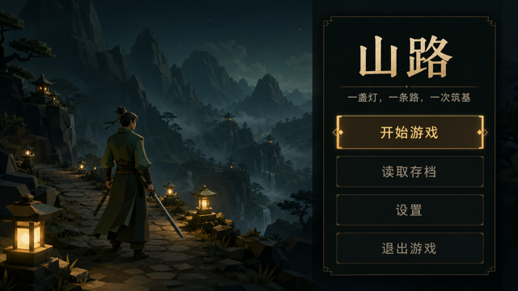
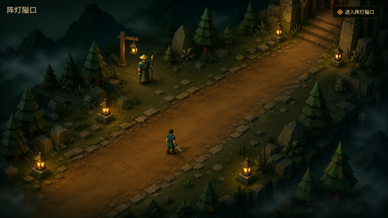
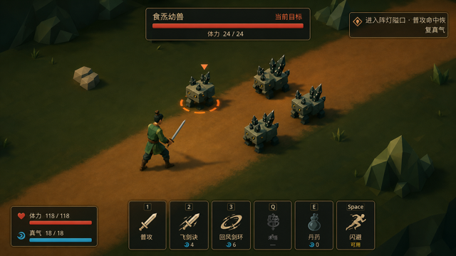
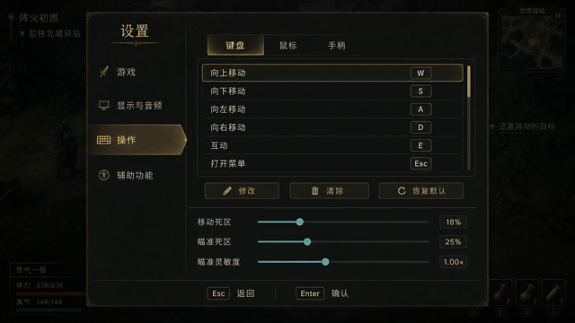

# R9 目标帧与表现清单

## 1. 用途

本组图片是 R9-0 的视觉实现基准，不是运行时素材，也不替代真实 Godot Metal 截图。四张目标帧
基于 2026-08-20 的 G6/R7/UI 截图使用 Codex 内置 imagegen 编辑生成，再通过以下确定性命令缩放
为 `640 x 360`：

```sh
sips -z 360 640 <generated-source.png> --out <target-frame.png>
```

实现允许根据真实低多边形资产和可读性调整细节，但必须保留构图、层级、功能色和信息取舍。
最终验收只接受仓库截图工具从运行时生成的 Metal 实图。

## 2. 目标帧

### 2.1 标题



- 左侧以山路、阵灯、旅人自然持剑姿态建立作品身份，右侧保持可立即操作的纵向菜单。
- 标题文案只表达世界和旅程，不出现“固定视角”“3D”“即时战斗”“原创”等开发说明。
- 默认焦点、读取、设置和桌面退出具有清楚但不等权的层级。

### 2.2 阵灯隘口入口



- 道路肩线、破石边缘、灯光和前中后景环境共同替代纯色平面与裸露清屏色。
- 主路和守灯人保持无遮挡；边界用山体、松林和雾层自然收束，不侵入导航。
- 探索 HUD 只保留地点与当前目标，不显示常驻操作说明或居中的巨大目的地标签。

### 2.3 首战 HUD



- 世界至少占主要视觉面积；玩家、敌群、目标和攻击方向不被底栏覆盖。
- 左下为体力/真气，顶部为单一目标条，右上为紧凑目标卡，底部为六格动作 dock。
- 动作格以图形、设备键位、短名称和状态遮罩为主，不常驻 Shift/Ctrl/Tab 教程句。

### 2.4 设置



- 左侧使用游戏、显示与音频、操作、辅助功能四个分类，右侧只展示当前分类。
- 操作分类使用键盘/鼠标/手柄切换、对齐的动作/键位列表和明确的修改/清除/恢复默认。
- 底部提供返回与确认提示；焦点使用暖金层级，不沿用蓝色工具面板或白色矩形焦点。

## 3. 视觉规范

### 3.1 色板

| 语义 | 目标色 | 用途 |
|---|---|---|
| 世界暗部 | `#07110F` | 清屏、远景、深色松林 |
| 面板 | `#0D1512` / 90% | HUD、菜单、对话和设置主面板 |
| 次级面板 | `#182019` / 82% | 列表行、未选动作、分组背景 |
| 边框 | `#796033` | 普通边框和分隔线 |
| 焦点金 | `#D0A34B` | 选中、当前目标、可交互重点 |
| 主文字 | `#F0E7D5` | 标题外的主要正文 |
| 次文字 | `#B7B2A4` | 描述、提示、未选项 |
| 旅人绿 | `#2F6B52` | 玩家服饰与身份提示 |
| 真气蓝 | `#2AA7C4` | 真气、瞄准和玩家方向 |
| 体力红 | `#D84A39` | 玩家/敌人体力 |
| 敌意橙 | `#ED6A32` | 前摇、危险和敌对目标 |

同一屏幕中焦点金只允许一个最高优先级区域。色彩不能作为关键状态的唯一表达，必须同时有文字、
图形、条形量或状态遮罩。

### 3.2 字号与间距

| 层级 | `640 x 360` 逻辑字号 | 示例 |
|---|---:|---|
| 游戏标题 | 42–48 | “山路” |
| 页面标题 | 26–30 | 设置、行囊、读取存档 |
| 对话正文 | 20–22 | DialogueLayer 正文 |
| 主要按钮/列表 | 16–18 | 开始游戏、设置分类、物品名 |
| HUD 关键数值 | 13–15 | 体力、真气、目标名 |
| 次级提示 | 11–12 | 键位、消耗、返回提示 |

- 主面板安全边距至少 16，内部主要分组间距至少 8，列表行高至少 28。
- 关键中文正文不低于 13；11–12 只用于可由图形或上下文补足的次级提示。
- 面板采用 1px 普通边框、2px 焦点左边或完整焦点轮廓，阴影不超过 4px。

### 3.3 状态规则

- 探索：地点短时出现，任务卡可折叠，互动提示只在有效范围内出现。
- 战斗：显示体力/真气、目标、动作与必要任务；不显示完整操作教程。
- 不可用：降低文字和图形亮度，并使用冷却、真气不足、未学或数量为零的明确短标签。
- 模态：背景压暗但仍能辨认返回来源；当前焦点和返回方式始终可见。
- 输入设备：只显示最近使用设备的键位；鼠标移动本身不应频繁抢走手柄提示。

## 4. 资产决策

### 4.1 保留

- GameRoot、GameSceneStack、GameRun、StoryContext、BattleSession 与现有内容 Resource。
- 五张地图的人工 spawn、Portal、StoryBinding、persistent ID、导航与生成器所有权。
- 共享 13 骨骼、六个动画语义名、角色/敌人 Definition 注入协议和 GLB 确定性生成管线。
- CombatFeedback3D 的命中停顿、闪白/红、剑弧、火花、残影与辅助模式逻辑。
- 原创音频、UI 光标 SVG、阵柱、阵芯、筑基坛和药草状态资产。

### 4.2 保留接口、重做表现

- 旅人/NPC 的 idle、run、attack、cast、hit、death 曲线和武器持握。
- 四种食炁兽的身体比例、头部、腿部和晶簇剪影；EnemyDefinition 与战斗规则不变。
- 地面、道路、碎石、松林和隘口环境模块的网格/材质层次；碰撞和导航边界不变。
- 标题肖像从校正后的正式旅人模型重新确定性渲染。
- HUD、Dialogue、Menu、Shop、SaveLoad、Settings 的布局与样式；GameScene 生命周期不变。
- 截图工具的取帧等待和状态构造，避免把动画切换首帧作为正式证据。

### 4.3 新增

- 本作共享 Theme Resource、共享 StyleBox/图标资源和少量界面组合场景。
- 阵灯隘口入口的道路肩线、自然边界和分段灯光/环境模块。
- R9 十二张截图工具以及真实输入动态检查说明。

## 5. imagegen 提示记录

四次调用均使用 Codex 内置 imagegen，输入分别为现有标题、隘口探索、键鼠战斗 HUD 和设置 Metal
截图。共同约束如下：

- 使用实际可在 Godot 中实现的低多边形 3D 与原生 UI，不生成运行时整张背景插画。
- 保留固定正交视角和核心交互构图，以暗绿、暖金、米白、真气蓝和敌意橙建立统一语言。
- 移除绑定姿势、纯色空地、裸露黑边、常驻教程句、蓝色工具面板和技术说明文案。
- 禁止第三方标识、水印、动漫角色、霓虹科幻 UI 和不可实现的巨型场景元素。

各目标帧的专用要求：

- 标题：左侧山路/阵灯/自然持剑旅人，右侧开始、读取、设置、退出纵向菜单。
- 探索：保持玩家、守灯人和道路方向，增加道路边缘、松林、岩石、灯光、远景和边界雾层。
- 战斗：保留六动作契约，缩减底栏，强化石兽剪影、目标条、体力/真气和世界前摇。
- 设置：改为四分类、三设备页签、动作键位列表、摇杆调校与底部返回/确认提示。

## 6. 文件哈希

```text
779a2632163b9becf8fc1b50ab7b2eec1e4c80d82d1717d961f4d5649764b781  01_title.png
9c5f8fb6f7287534f34d1dd1be4a91bef621030a639971991b2539b60839f728  02_lantern_entry.png
afc765f8378ced078c2e1d94b0d6012b2a4933d81a7a48185017ac6f9db98ccd  03_combat_hud.png
e15d33b026091eb61d057c40a7676d39a39934ff84ae04a672668b9b536e6518  04_settings.png
```
